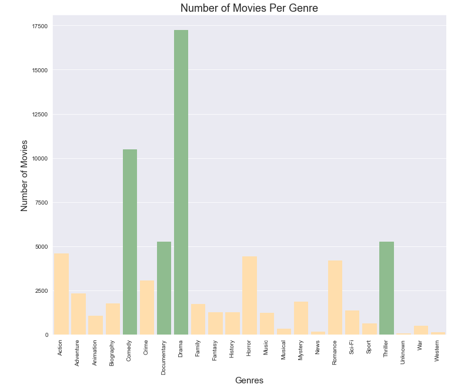
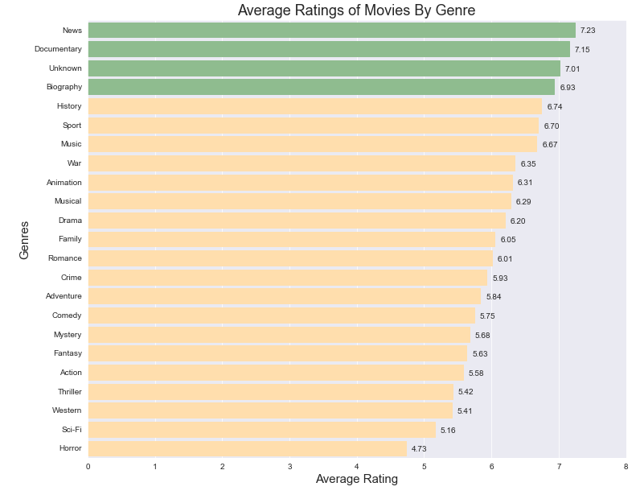
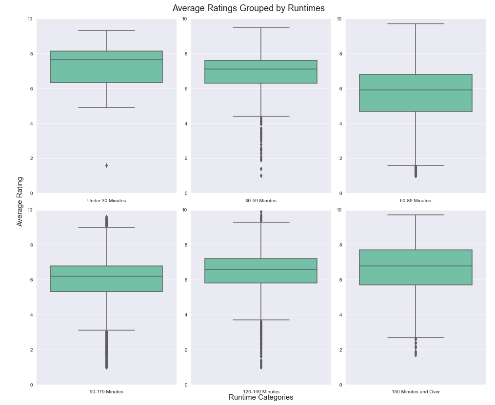
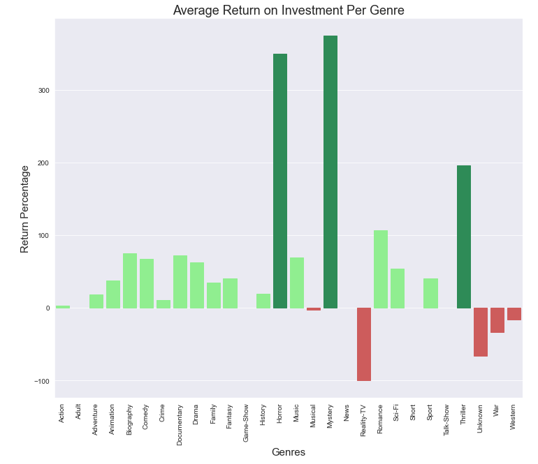

# Movie Data Analysis for Microsoft Recommendations
Author: Tosca Le


## Overview

This project explores different types of films in order to identify actionable recommendations for Microsoft's new movie studio. Descriptive analysis of which films perform the best at the box office shows that film ratings can vary depending on the genre and runtime. In addition, some genres tend to have a greater return on investment when compared to others. Microsoft can use this analysis to aid their decision in prioritizing what types of films to produce.
***

## Business Problem

Like other companies creating original video content, Microsoft may be able to appropriately allocate their resources and produce movies that will perform well based on specific success metrics. By doing so, Microsoft can make decisions on what types of movies to create as the new movie studio grows. By using datasets from some of the most popular film review websites, such as IMDb, I describe the relationship between genres, ratings, and gross to anticipate what films will be successful.
***

## Data

IMDb and The Numbers are popular movie review sites that have a plethora of datasets on not only ratings, but gross and other information related to the movie. 
The IMDb basics dataset includes movie titles from 2010 to projected titles up until 2115, with additional information in runtime and genres. The IMDb ratings dataset includes average rating and number of votes for each movie. The Numbers dataset includes movie characteristics such as release date, production budget, domestic and worldwide gross.

***


## Methods

This project uses descriptive analysis, including trends based on categories of the data. This provides an overview of rating based on genres, runtimes, gross and how this factors into return on investment.
I prepared the data by checking for null values, changing specific datatypes, and transforming the dataframes to obtain unique genres or add necessary columns. Given the data and business problem, these steps were neccesary as not one dataset had all the characteristics and information needed for analysis. 

***


## Results

News, Documentaries, and Biography genres have higher rated movies. Although, one thing to keep in mind is that these genres don't have as many movies as other genres such as Comedy, Drama, and Thriller.





The average runtime for movies is about 100 minutes. On the opposite ends of the range, movies that are less than 30 minutes and over 150 minutes have higher ratings. Again, another thing to consider are the genres and number of movies within each genre. Although there may be fewer movies in genres such as Documentary, there might be a greater likelihood for high reviews. The audience might be more atuned to these genres. Movies above the average 100 minutes, have higher ratings than movies that are shorter.



Horror, Mystery, and Thriller have the greatest average return on investment. On the other hand, Reality-TV, War, and Western movies had an overall loss.



***


## Conclusions

This analysis leads to three recommendations for Microsoft to consider as they begin to develop films under their new movie studio:

* In terms of average rating, movies in News, Documentaries and Biography have higher ratings compared to others. While these genres may not currently have as many films as other genres, it is likely that overall ratings will be high for these genres, potentially bringing in continued viewership and support for Microsoft's movie studio.
* When considering the average runtime, movies longer than 120 minutes will have an overall higher rating than movies shorter than 100 minutes. Movies that are either very short or very long received higher ratings possibly due to the nature of these genres. Microsoft should consider these runtimes when producing specific genres.
* Microsoft can leverage movies in genres such as Horror, Mystery and Thriller to make a greater return on the initial production budget. Reality-TV, War and Western movies should be reconsidered when deciding budget since these genres had an overall loss.

### Next Steps

Further analyses could lead to additional and more specific insights to produce movies that will perform best:

* Additional data on the demographics of the audience would be helpful to explore why certain genres are more popular when the number of movies vary greatly from genre to genre. This could help better predict ratings and the correlation to runtime as well.
* A better prediction of domestic versus worldwide gross and could predict the success of certain movies based on different markets. Additionally, differentiation between sales (e.g. box office sales vs. streaming sites) could predict what types of movies are more successful during its inital release or over a period of time.
***

## For More Information

Please review my full analysis in my [Jupyter Notebook](./movie_data_analysis.ipynb) or [presentation](./movie_data_analysis_presentation.pdf).

For any additional questions, please contact me at **toscatle@gmail.com**.

## Repository Structure


```
├── images
├── .gitignore
├── LICENSE                          
├── README.md 
├── movie_data_analysis.ipynb                                  
└── movie_data_analysis_presentation.pdf                               
```
